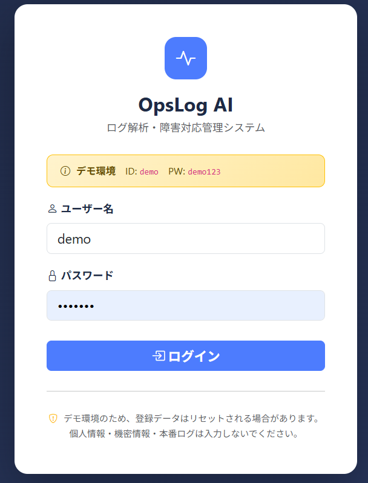
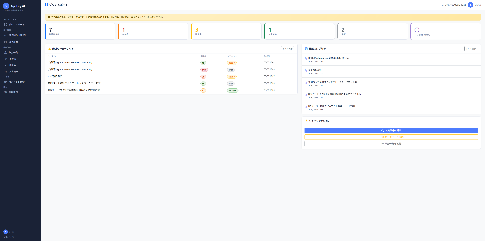
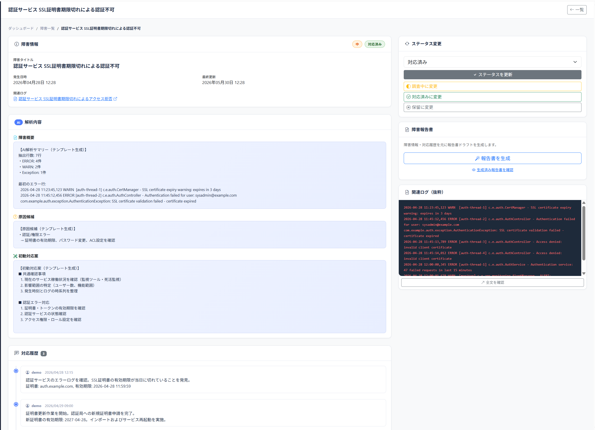
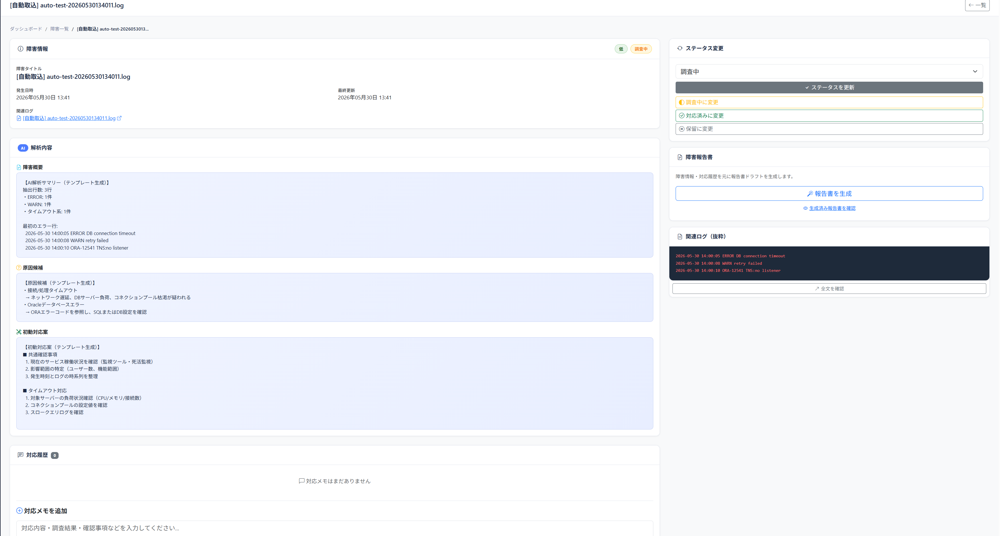
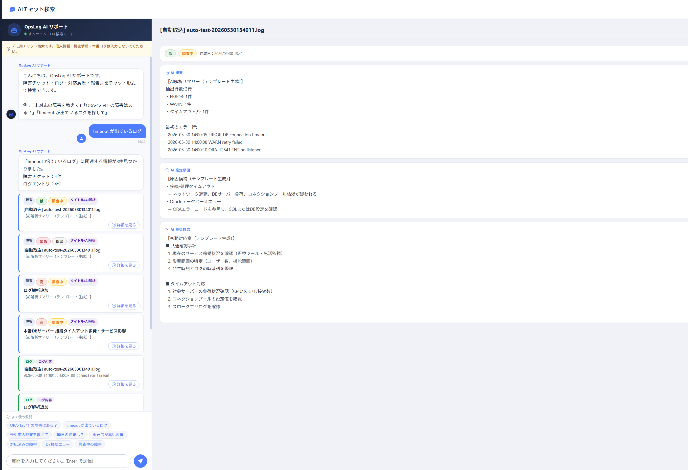
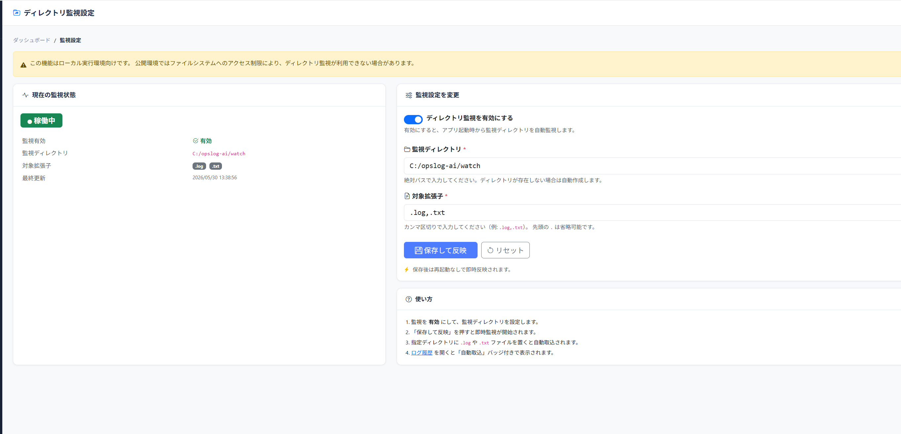
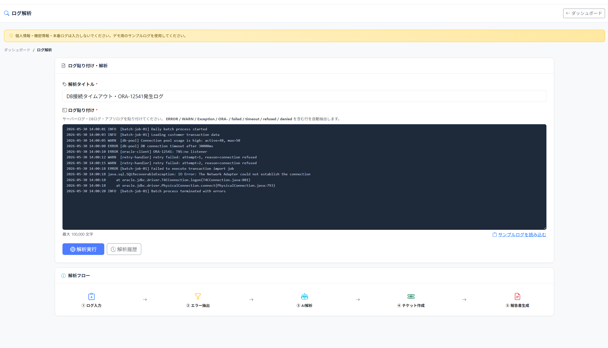
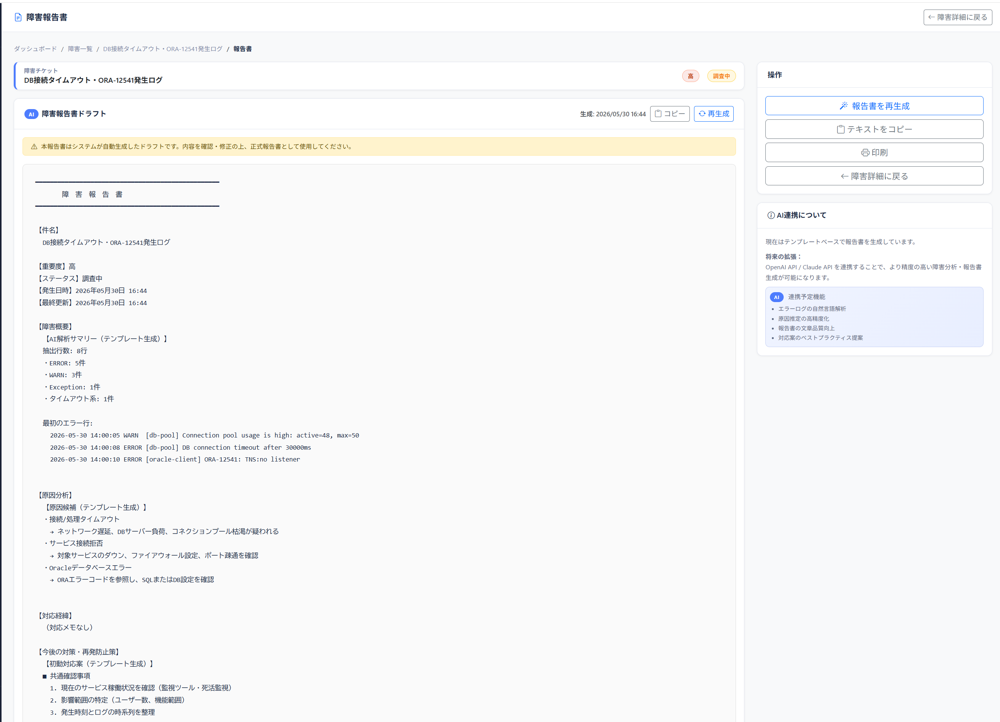

# OpsLog AI

ログ解析・障害対応管理システム

---

## 概要

OpsLog AI は、サーバログやDBログを登録・解析し、エラー行の抽出、障害チケット管理、対応履歴管理、障害報告書生成、AIチャット風検索を行う業務支援Webアプリです。

運用担当者・社内SE・インフラ/DB運用担当者が、障害調査や初動対応、報告作成を効率化することを想定しています。

---

## スクリーンショット

### ログイン画面



### ダッシュボード



### ログ解析履歴・自動取込



### 障害詳細



### AIチャット検索



### ディレクトリ監視設定



### ログ解析入力



### 障害報告書生成



---

## 主な機能

* デモログイン（ID: `demo` / PW: `demo123`）
* ダッシュボード（インシデント件数・重要度サマリー）
* ログ手動登録
* エラー行抽出（ERROR / WARN / Exception / ORA- / failed / timeout / refused / denied）
* ログ解析履歴
* 障害チケット作成
* ステータス管理（未対応 / 調査中 / 対応済み / 保留）
* 対応メモ登録
* 障害報告書生成
* ディレクトリ監視によるログファイル自動取込
* 監視設定画面（拡張子・ディレクトリ指定）
* AIチャット風検索UI
* チャット結果から右ペイン詳細表示（画面全体遷移なし）
* sessionStorage による一時的なチャット履歴保持

---

## 技術構成

| 分類        | 技術                    |
| ----------- | ----------------------- |
| Backend     | Java 17, Spring Boot    |
| View        | Thymeleaf               |
| Security    | Spring Security         |
| DB          | SQLite                  |
| ORM         | Spring Data JPA         |
| Frontend    | HTML, CSS, JavaScript   |
| Build       | Maven / Maven Wrapper   |
| Log Watch   | Java WatchService       |

---

## 前提環境

- Java 17
- Windows 10 / 11
- Maven Wrapper 使用のため Maven の事前インストールは不要

---

## 起動方法

```powershell
.\mvnw.cmd spring-boot:run
```

または

```powershell
.\run.cmd
```

アクセスURL：

```
http://localhost:18080
```

デモログイン：

```
ID: demo
PW: demo123
```

---

## ログ解析の使い方

1. ログイン
2. 「ログ解析（新規）」を開く
3. サンプルログを貼り付ける
4. 解析実行
5. ERROR / WARN / Exception / ORA- / failed / timeout / refused / denied を含む行を抽出
6. 解析結果から障害チケットを作成

---

## サンプルログ

ログ解析画面で動作確認する場合は、以下のようなダミーログを使用できます。

```log
2026-05-30 14:00:01 INFO  [batch-job-01] Daily batch process started
2026-05-30 14:00:05 WARN  [db-pool] Connection pool usage is high: active=48, max=50
2026-05-30 14:00:08 ERROR [db-pool] DB connection timeout after 30000ms
2026-05-30 14:00:10 ERROR [oracle-client] ORA-12541: TNS:no listener
2026-05-30 14:00:12 WARN  [retry-handler] retry failed: attempt=1, reason=connection refused
2026-05-30 14:00:18 java.sql.SQLRecoverableException: IO Error: The Network Adapter could not establish the connection
```

---

## ディレクトリ監視の使い方

1. 「監視設定」を開く
2. 監視を有効にする
3. 監視ディレクトリを指定する
4. 対象拡張子を `.log,.txt` に設定する
5. アプリ起動後に監視ディレクトリへログファイルを配置する
6. ログ履歴に「自動取込」として表示される

> **注意：** この機能はローカル実行環境向けです。公開環境では利用できない場合があります。

---

## AIチャット検索の使い方

1. 「AIチャット検索」を開く
2. 「timeout が出ているログ」などを質問する
3. 関連する障害・ログがカード形式で表示される
4. 「詳細を見る」を押すと右ペインだけ切り替わる
5. 左側のチャット履歴は維持される

> **注意：** 現在のAIチャット検索は、外部LLM APIを使わず、DB検索＋AI風回答生成で動作しています。将来的に OpenAI API / Claude API へ差し替え可能な構成です。

---

## 注意事項

* デモ用アプリです
* 登録データはリセットされる場合があります
* 個人情報・機密情報・本番ログは入力しないでください
* サンプルログはダミーデータのみ使用してください
* APIキーや秘密情報は含めないでください

---

## Web公開時の注意

### ディレクトリ監視について

* ディレクトリ監視機能はローカル実行環境向けです
* Render / Railway などのクラウド環境ではファイルシステムへのアクセスに制約があるため、利用できない場合があります
* `application.properties` の `opslog.watch.enabled=false`（デフォルト値）のまま公開してください

### データの永続化について

* 本アプリは SQLite をファイルベースのDBとして使用しています
* Render / Railway などのクラウド環境では、コンテナ再起動・再デプロイ時に登録データがリセットされます
* 永続化が必要な場合は PostgreSQL などの外部DBへの移行が必要です

### デモ用途について

* 本アプリはポートフォリオ・デモ用途を想定しています
* 個人情報・機密情報・本番ログは絶対に入力しないでください

### Render へのデプロイ手順（概要）

1. GitHub リポジトリに `Dockerfile` を含めてプッシュする
2. [Render](https://render.com) にサインインし、「New Web Service」を作成する
3. GitHub リポジトリを連携する
4. Runtime: `Docker` を選択する
5. 環境変数 `PORT` は Render が自動設定する（設定不要）
6. 「Create Web Service」をクリックしてデプロイする

### Railway へのデプロイ手順（概要）

1. GitHub リポジトリに `Dockerfile` を含めてプッシュする
2. [Railway](https://railway.app) にサインインし、「New Project」→「Deploy from GitHub repo」を選択する
3. リポジトリを選択すると `Dockerfile` を自動検出してビルドが始まる
4. 環境変数 `PORT` は Railway が自動設定する（設定不要）
5. 「Generate Domain」でアクセスURLを発行する

---

## 今後の拡張予定

* OpenAI API / Claude API 連携
* 障害報告書のAI生成精度向上
* ログ分類ルールの拡張
* Excel / CSV 出力
* Docker対応（Dockerfile 追加済み）
* PostgreSQL対応
* RAG / ナレッジ検索連携

---

## ポートフォリオ説明文

```
Java / Spring Boot / Thymeleaf / SQLite を用いた、サーバログ解析・障害対応管理Webアプリです。
ログ手動登録、ディレクトリ監視による自動取込、障害チケット管理、対応履歴管理、報告書生成、AIチャット風検索UIを実装しています。
運用・DB・障害調査の業務改善を想定したポートフォリオアプリです。
```
